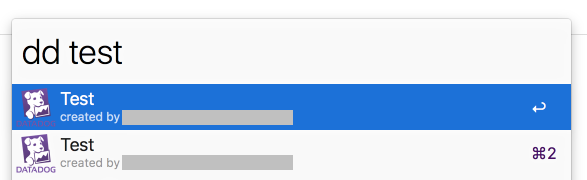
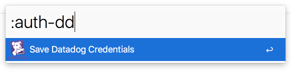
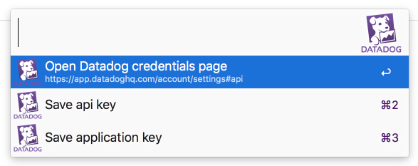
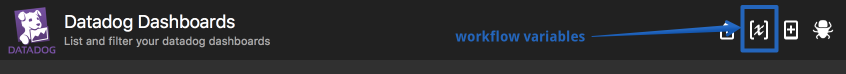
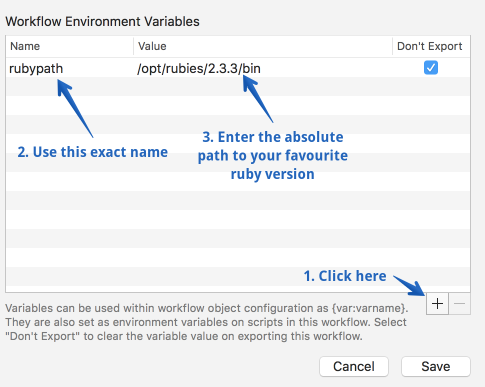

# Datadog Dashboards for Alfred

List and filter your Datadog dashboards from Alfred3.

## Usage

`dd [QUERY]`

Press enter to open the dash URL.
Press shift+enter to copy the dash URL to your clipboard.

## Setup

**1. Install the workflow**

Please note that this workflow requires Alfred3. It will not work with Alfred2 or lower.

**2. Datadog credentials**

Use the `:auth-dd` command in Alfred to add your Datadog api and app keys. The Datadog API requires both of these to access the dash list. They will be saved in your OSX keychain.

**3. Ruby version (optional)**

Set the `rubypath` workflow variable to point to a recent Ruby version. If you skip this step, your system Ruby will be used. This workflow is not tested with really old versions of Ruby.

